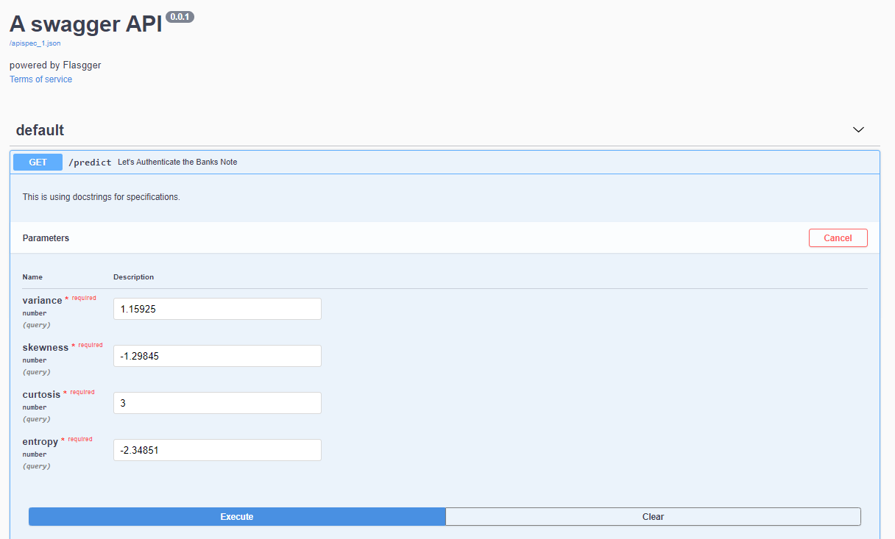
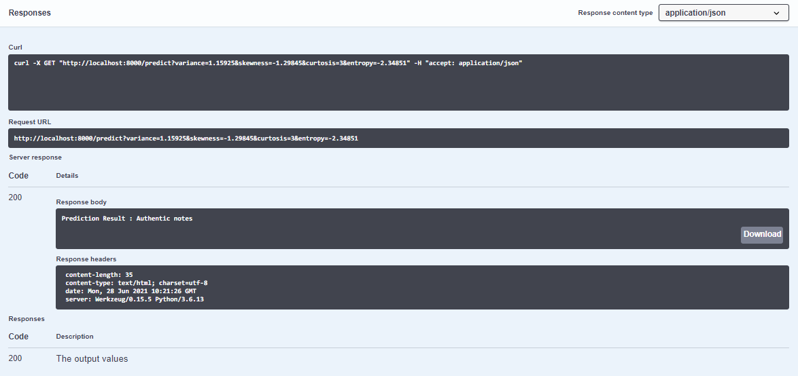

## BankNote Authentication

### Model: RandomForest Classifier

## Usage 
Run webapp using the command below
```
python flask_api.py 
```

## Docker build image
```
docker build -t name .
```
## Docker run
```
docker run name
```

## Swagger API screenshot



